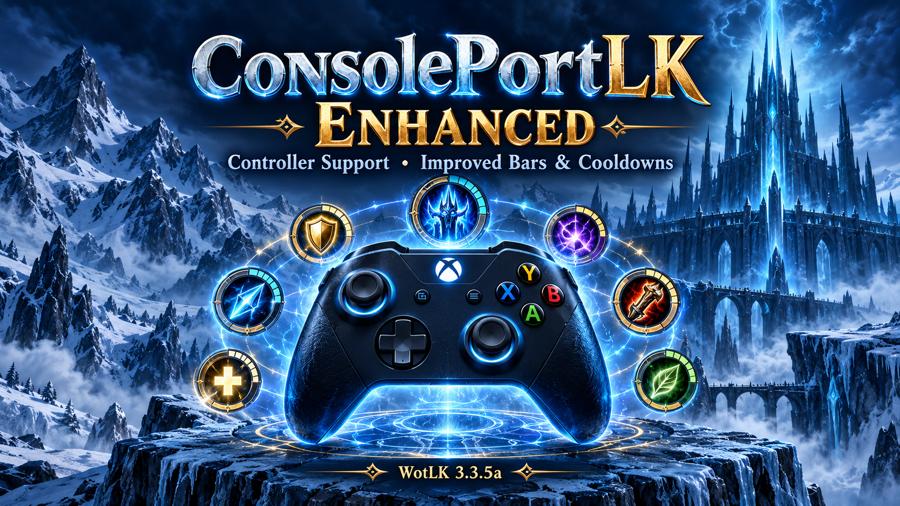

# ConsolePortLK Enhanced — WoW WotLK 3.3.5a Controller Addon

**Play World of Warcraft: Wrath of the Lich King (WotLK) 3.3.5a with a controller using ConsolePortLK Enhanced.**

An enhanced fork of [leoaviana’s ConsolePortLK](https://github.com/leoaviana/ConsolePortLK), based on the original WotLK backport. It retains the original controller interface and adds improvements to cooldown displays, action-bar layouts, settings navigation, and saved layout preferences. ConsolePortLK itself backports [Sebastian Lindfors’s ConsolePort](https://github.com/seblindfors/ConsolePort).

This fork is maintained by [SuttonX](https://github.com/SuttonX). Please report Enhanced-specific issues here rather than to the original ConsolePort project. Original authorship and the Artistic License 2.0 are preserved.

## Controller mapper required

Use a controller-to-keyboard/mouse mapper such as **GameNative**, **Steam Input**, **[AntiMicroX](https://github.com/AntiMicroX/antimicrox)**, **[WoWPadX](https://github.com/leoaviana/WoWpadX)**, or your own compatible mapping setup.  WoW 3.3.5a requires mapped keyboard/mouse input; select the controller preset and calibrate ConsolePortLK to your mapper's outputs.

The maintainer previously played the original ConsolePortLK successfully on an **Android device using GameNative and a custom mapping setup**.  Enhanced development and testing used WoWPadX.  The Xbox LT/RT configuration below was also successfully tested on Windows using AntiMicroX with eight-direction arrow-key movement.  WoWPadX remains a documented option, with the tested input mappings below; it is not required.  Enhanced has not been separately tested with every mapper/device combination.

### Tested configuration and compatibility

**Enhanced development and in-game testing used WoWPadX with an Xbox controller and LT/RT rear triggers as the two modifiers.** In the example mapping below, LT holds Left Shift and RT holds Left Ctrl.

The improvements use shared addon code and are expected to work with other supported controller presets and compatible modifier mappings as well. Other controller hardware and every modifier combination have not been individually tested. If something behaves differently, please [report an issue](https://github.com/SuttonX/ConsolePortLK-Enhanced/issues) and include your controller, selected controller preset, mapper and version, modifier assignments, action-bar layout, client version, and steps to reproduce it. Screenshots and Lua errors help with display or navigation problems.

### Xbox mapping for another input mapper

> **NOT REQUIRED if you use WoWPadX.** WoWPadX supplies the controller mappings for its selected profile; you do not need to enter the mappings below manually. Select your modifier profile in WoWPadX and complete ConsolePortLK’s normal calibration. This table is only a reference for configuring another input mapper, such as AntiMicroX, Steam Input, or GameNative.

This table follows WoWPadX’s **triggers-as-modifiers** profile, matching the Xbox configuration used during development, with arrow keys offered as a tested alternative to its default WASD movement. It is a physical-input mapping, not a list of the in-game actions assigned to those inputs. Calibrate with `/cp recalibrate` after selecting this profile or changing mapper settings.

| Xbox control | Keyboard or mouse output |
| --- | --- |
| A | F11 |
| B | F10 |
| X | F12 |
| Y | F9 |
| D-pad up | F1 |
| D-pad right | F2 |
| D-pad down | F3 |
| D-pad left | F4 |
| View / Back (SELECT) | F5 |
| Menu (START) | F6 |
| LB, left bumper | F7 |
| RB, right bumper | F8 |
| LT, left rear trigger | Hold **Left Shift** |
| RT, right rear trigger | Hold **Left Ctrl** |
| Left stick movement | Arrow keys or WASD |
| Left stick click, L3 | Left mouse button |
| Right stick movement | Mouse movement |
| Right stick click, R3 | Right mouse button |
| Xbox / Guide button, if exposed to the mapper | Numpad multiply (`*`) |
| Share / capture button (newer Xbox controllers), if exposed as Misc1 | Numpad add (`+`) |
| Elite right paddle 1, if exposed independently | Numpad 0 |
| Elite right paddle 2, if exposed independently | Numpad 1 |
| Elite left paddle 1, if exposed independently | Numpad 2 |
| Elite left paddle 2, if exposed independently | Numpad 3 |

**Arrow-key movement:** map left-stick up/down/left/right to the corresponding keyboard arrows, with diagonals sending two arrows simultaneously.  This avoids typing WASD letters into text fields, although arrows can still move a text cursor or navigate chat history.  Use eight-direction movement without H/V if you want to avoid letter input entirely, then recalibrate.

Use ordinary held inputs: pressing a trigger sends modifier-down, releasing it sends modifier-up. Holding both triggers must produce **Shift + Ctrl** simultaneously. Avoid toggle or turbo mode for movement, modifiers, and stick clicks. Map the right stick to relative mouse movement and give both sticks an appropriate dead zone.

Numpad multiply and add are distinct from typing `Shift+8` or `Shift+=`. View / Back is the button commonly called SELECT; Menu / Start is START. The Share button is a separate screenshot/video capture button on newer Xbox controllers, not SELECT. Guide/Share availability depends on the controller and operating system. Many Elite configurations expose paddles as duplicates of existing buttons; the separate paddle outputs above apply only when the mapper can see independent paddle inputs. Standard Xbox controllers do not have paddles.

**Optional 16-way movement:** WoWPadX additionally sends H for the horizontal-dominant intermediate diagonal sectors and V for the vertical-dominant sectors. These are supplementary sector outputs, not replacements for the four movement directions. A basic eight-direction arrow-key or WASD setup can omit them; match the addon’s movement configuration to the mapper’s capabilities. WoWPadX’s automatic walk/run handling uses additional feedback logic, so copying the physical mappings does not reproduce every WoWPadX feature.

WoWPadX also supports other modifier profiles:

| Modifier profile | LB | RB | LT | RT |
| --- | --- | --- | --- | --- |
| Left shoulder + left trigger (WoWPadX’s default profile) | Left Shift | F7 | Left Ctrl | F8 |
| **Both triggers: tested/recommended here** | F7 | F8 | Left Shift | Left Ctrl |
| Right shoulder + right trigger | F7 | Left Shift | F8 | Left Ctrl |
| Both shoulders | Left Shift | Left Ctrl | F7 | F8 |

The trigger profile above is our tested configuration; it is **not** WoWPadX’s factory-default modifier selection. Recalibrate whenever changing profiles. Optional L1/R1 bar indicators retain the original addon’s modifier-label behavior; their captions can reflect the configured modifiers rather than literally naming Xbox bumpers.

Mapping sources: [WoWPadX KeybindDefaults.h](https://github.com/leoaviana/WoWpadX/blob/4c435e0c6a9247fe50dc0dac0f23796058393c4a/WoWpadX/KeybindDefaults.h) and [InputMapper.cpp](https://github.com/leoaviana/WoWpadX/blob/4c435e0c6a9247fe50dc0dac0f23796058393c4a/WoWpadX/InputMapper.cpp). These links pin the inspected version so the documented mappings remain traceable.

## Features and improvements

These features and improvements build on the original ConsolePortLK backport.

### New features

- **Cooldown satellites on every layout except Triple:** abilities on inactive modifier bars can appear while cooling down, without holding those modifiers. Triple retains its permanently visible modifier bars.
- **Inactive-bar cooldown controls:** choose up to one hour, ten minutes, or five minutes remaining, or turn these displays off. Short global cooldowns are excluded.
- **Separate saved layout profiles:** size, scale, artwork, and positioning preferences are retained independently when switching layouts and logging out.
- **Optional FormFreedom integration:** the controller cursor can select supported FormFreedom menu helpers, and the displayed modifier bar is reconciled afterward. Automatic druid form cancellation remains in the separate [FormFreedom addon](https://github.com/SuttonX/FormFreedom).

### Fixes and improvements

- **Druid-form action-bar glitches:** improved action-page and action-identity refreshes when switching forms or bonus bars, so cooldown text and swipes follow the correct actions. Added spell-cooldown fallback for cases where the client temporarily reports an empty action-slot cooldown after a form/page transition.
- **Modifier-bar updates:** cooldown displays refresh when modifiers are pressed or released. Triple wings track their own modifier actions rather than inheriting the currently displayed main-bar layer.
- **Cooldown rendering:** reworked the original countdown renderer for reliable updates, proportional sizing, readable placement, whole-second/minute formatting, urgency colors, and coordination with OmniCC to avoid duplicate text.
- **Satellite display behavior:** cooldown satellites disappear at expiry, restore their normal labels, and handle hover and overlapping modifier layers consistently.
- **Scalable bar geometry:** improved Minimal button, satellite, artwork, highlight, and border proportions; retained native layout geometry where appropriate.
- **Settings navigation:** ordinary first launch selects General and its heading. Returning from Bindings or reopening settings restores the subsection selected during that session, including Advanced and Action Bars.
- **Action Bars configuration:** improved the populated integrated editor, optional-button checkbox behavior, and layout presentation restoration.
- **Save and reload handling:** reload prompts reflect the final difference from the loaded settings. Reverting an edit before saving does not itself require a reload.
- Fixed the original RT+A default binding, which targeted an Extra Action Button unavailable in WotLK 3.3.5a - a leftover from backporting ConsolePort from newer WoW versions.  It now maps to a usable action-bar slot, with the equivalent correction applied across all relevant controller presets.
- **Input reliability:** reduced redundant binding writes and improved calibrated stick-click fallback, binding-view focus, and cursor click handling.
- **Update processing:** reduced repeated callback work and nameplate polling. No independently measured performance gain is claimed.
- **Smaller fixes:** removed debug chat noise, corrected an optional specialization API call, and corrected raid-marker labels in the keyboard editor.

### Fresh-install defaults and documentation

- Pixel bridge and controller nameplates are enabled by default; the optional on-screen keyboard and double-modifier-tap behavior are disabled by default.
- RT+A refers to the tested Xbox LT/RT modifier profile. Other controller preset bindings and the Wii template retain their original defaults.
- Optional upper bar indicators begin unchecked on fresh profiles. Their original modifier-label behavior is retained.
- Added Xbox input mappings for alternative mappers, WoWPadX setup guidance, compatibility notes, source comparison documentation, and testing history.

Testing history, confirmed results, and remaining limits are documented in [TESTING.md](TESTING.md).

See [CHANGELOG.md](CHANGELOG.md) for technical details and [UPSTREAM-CHANGES.md](UPSTREAM-CHANGES.md) for the complete source-file inventory and review notes.

## Installation

Download the ready-to-install [ConsolePortLK-Enhanced.zip](https://github.com/SuttonX/ConsolePortLK-Enhanced/releases/latest/download/ConsolePortLK-Enhanced.zip). The release asset keeps this filename across versions.

### Updating an existing Enhanced installation

Fully close WoW, download the latest install ZIP, and replace all eight ConsolePort addon folders.  **Keep your ConsolePort SavedVariables** to preserve your bindings, calibration, and layouts.  Any release-specific migration instructions belong in the [release notes](https://github.com/SuttonX/ConsolePortLK-Enhanced/releases/latest).

**Updating Enhanced: SavedVariables KEEP; CLIENT RESTART.**

### Required clean install when first switching to Enhanced

**For your first installation of ConsolePortLK Enhanced, remove all previous ConsolePort / ConsolePortLK addon folders and their saved settings before installing Enhanced.** Existing saved bindings and settings can override Enhanced's fresh defaults.

1. **Fully close WoW.**
2. In `World of Warcraft/Interface/AddOns/`, delete all addon folders belonging to previous ConsolePort or ConsolePortLK installations, including their modules and any renamed copies. The standard folders are `ConsolePort`, `ConsolePortAdvanced`, `ConsolePortBar`, `ConsolePortHelp`, `ConsolePortKeyboard`, `ConsolePortLoader`, `ConsolePortUI_Loot`, and `ConsolePortUI_Menu`.
3. Delete all ConsolePort / ConsolePortLK SavedVariables files, including `.lua` and `.lua.bak` copies, from **both your account and character SavedVariables folders**: `WTF/Account/ACCOUNT/SavedVariables/` and `WTF/Account/ACCOUNT/REALM/CHARACTER/SavedVariables/`. Replace ACCOUNT, REALM, and CHARACTER with your actual folder names. Remove only ConsolePort-related files (normally `ConsolePort*.lua` and `ConsolePort*.lua.bak`). Repeat for every account and character that used the previous addon. **Do not delete unrelated settings or the entire WTF folder.**
4. Download the install ZIP attached to this fork's GitHub release. GitHub's automatic “Source code” ZIP contains a repository parent folder; it is not the ready-to-install archive.
5. Extract the eight addon folders directly into `World of Warcraft/Interface/AddOns/`.
6. Configure your preferred controller mapper (for example, GameNative, Steam Input, [AntiMicroX](https://github.com/AntiMicroX/antimicrox), or [WoWPadX](https://github.com/leoaviana/WoWpadX)), connect your controller, and set the desired button/modifier mappings.
7. Start WoW, enable the modules you need, select your controller preset, and complete calibration.

**Initial switch to Enhanced: SavedVariables DELETE; CLIENT RESTART.** This resets old ConsolePort bindings, calibration, and layout preferences, so configure them again. This is the initial-install requirement, not an instruction to erase settings for every future update. The optional on-screen keyboard is disabled by default on a fresh configuration.

### Optional druid form support

Install [FormFreedom](https://github.com/SuttonX/FormFreedom) separately if you want automatic form cancellation for its supported interactions. FormFreedom works independently on desktop and alongside ConsolePortLK. Its cancellation logic is not bundled into Enhanced; the integration here supports controller selection and correct bar-state reconciliation.

### Switch between desktop and controller setups

Pair ConsolePortLK Enhanced with [SetupSwap](https://github.com/SuttonX/SetupSwap) to save separate mouse-and-keyboard and controller setups, each with their own addon selections, captured settings and window positions, chat layouts, and native WoW keybindings.  Switch from your desktop layout to a couch or handheld controller layout through SetupSwap’s settings window, slash commands, or minimap button - all without logging out of the game.

SetupSwap profiles are account-wide, and switching applies the saved setup through a UI reload.  SetupSwap is a separate, optional addon; [download the latest SetupSwap.zip](https://github.com/SuttonX/SetupSwap/releases/latest/download/SetupSwap.zip) and follow its setup instructions to capture each profile.

## Copying settings between characters

ConsolePortLK Enhanced stores some settings for the whole account and others per character.  **Controller selection, calibration, and general addon/UI settings are shared within the same account.**  Controller bindings are stored per character and specialization; controller-bar layouts, layout-specific size/scale preferences, mouse settings, and utility-ring contents also have character-specific storage.

### Copy controller bindings in game

1. Log in to the **source character** and activate the specialization whose bindings you want to copy.
2. Open `/cp config`, select **Bindings**, and click **Save**.  This saves the current bindings and records a non-default binding profile in the account's shared import list.
3. Log in to the **destination character**, activate the specialization you want to configure, and open `/cp config` → **Bindings**.
4. Click **Import**, or **Import / Export** if ConsolePortAdvanced is enabled.
5. Select the saved source-character/specialization profile, then click **Import**.  Review the bindings and click **Save** in the main settings window.  Repeat for another specialization if needed.

Import copies bindings into the destination's active specialization; later character-specific binding edits do not change the source character's bindings.  It does **not** copy controller-bar layout settings or place the source character's spells onto the destination's action bars.

If the source profile is missing, make sure you clicked **Save** on the source character.  Unmodified default bindings are not exported as a separate character profile—use the matching controller preset instead.  Identical saved binding sets can also be deduplicated, so an equivalent profile may appear under another character's name.  For transfers between different accounts, ConsolePortAdvanced provides binding-string export/import from the same window.

### Copy character-specific settings using Windows File Explorer

Use this method when you also want the source character's bar layouts and other character-specific settings.

1. Log in to the source character, save your desired settings, then **fully close WoW** so its saved variables are written to disk.  If the destination character has never logged in, log in once and close WoW to create its folders.
2. Open your WoW folder, then `WTF/Account/ACCOUNT/REALM/SOURCECHARACTER/SavedVariables/`.  Replace ACCOUNT, REALM, and SOURCECHARACTER with the actual folder names.
3. Back up the destination's existing ConsolePort files from `WTF/Account/ACCOUNT/REALM/DESTINATIONCHARACTER/SavedVariables/`.
4. Copy these files from the source's **character** SavedVariables folder into the destination's **character** SavedVariables folder, replacing the corresponding files:
   - `ConsolePort.lua`: controller bindings for saved specializations, mouse settings, and utility-ring contents.
   - `ConsolePortBar.lua`: controller-bar configuration, including saved layout-specific preferences.
   - Optional `ConsolePortLoader.lua`, if present: the character's ConsolePort loader binding.
5. Start WoW and log in to the destination character.  Check both specializations, bar layouts, mouse behavior, and utility-ring entries.  Adjust entries that refer to source-specific spells, items, or macros.

Copy the `.lua` files; the `.lua.bak` files are backups.  **Do not copy the entire WTF folder or overwrite the account-level `WTF/Account/ACCOUNT/SavedVariables/ConsolePort.lua` for a same-account character transfer.**  The account-level file is different from the character-level file even though both are named ConsolePort.lua.

These methods copy addon settings and bindings, not the character's server-stored spells/action-bar contents.  The file-copy method replaces the destination's corresponding settings rather than merging them.  The required clean-install reset above applies only when first switching from an older ConsolePort installation to Enhanced; **do not delete your saved settings just to copy them between characters.**

## Commands

| Command | Purpose |
| --- | --- |
| `/cp` | List addon commands |
| `/cp config` | Open settings |
| `/cp actionbar` | Configure the controller action bar |
| `/cp help` | Open help and tutorials |
| `/cp recalibrate` | Recalibrate controller inputs |
| `/cp type` | Change controller type |
| `/cp cvar` | Inspect console variables; advanced use |
| `/cp resetall` | Reset addon settings; irreversible |

## Client and platform notes

The tested target is **WotLK 3.3.5a**. A client identifying itself as 3.3.5 may be the normal 3.3.5a client build; compatibility with a separately different 3.3.5 client has not been independently established. Modified client APIs and custom server behavior can affect compatibility.

For Steam Deck/Proton/Wine, consult the [original ConsolePortLK setup guidance](https://github.com/leoaviana/ConsolePortLK#readme). WoWPadX and WoW may need to run in the same Wine/Proton prefix. A Steam keyboard/mouse layout is an alternative when the mapper cannot attach to the game, but the alternative configuration still needs calibration.

## Credits and license

- [Sebastian Lindfors / seblindfors](https://github.com/seblindfors/ConsolePort): original ConsolePort.
- [Leandro Araujo / leoaviana](https://github.com/leoaviana/ConsolePortLK): ConsolePortLK backport and [WoWPadX](https://github.com/leoaviana/WoWpadX).
- dan-schales: binding-update optimization included through the upstream contribution documented in the development history.
- [SuttonX](https://github.com/SuttonX): Enhanced development, runtime testing, and maintenance.

Distributed under the existing [Artistic License 2.0](LICENSE). This fork is not affiliated with Blizzard or the original ConsolePort project.
